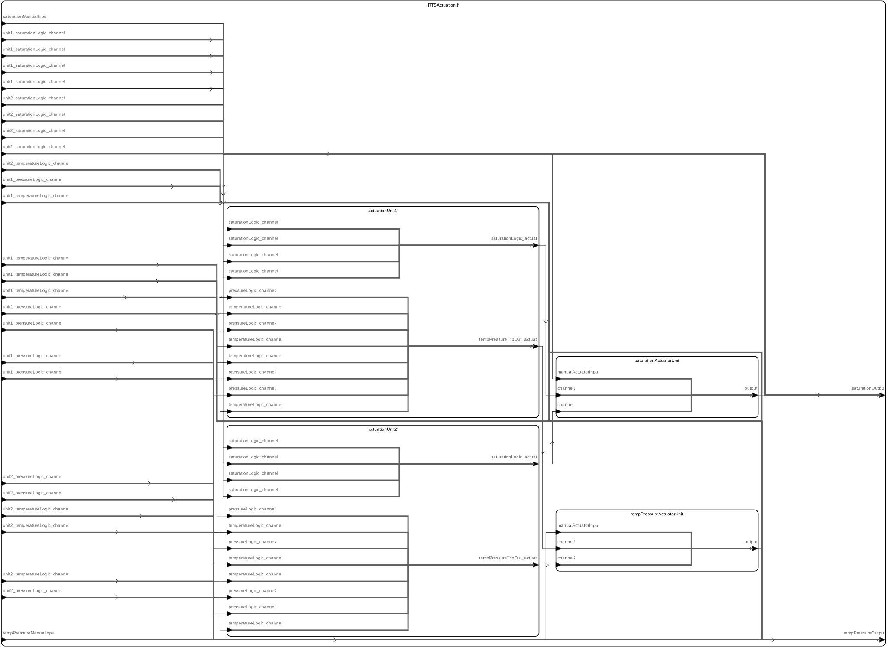

# <!---title_start-->RTS<!---title_end-->
<!---description_start-->
<!---description_end-->
## <!--arch-section-title_start-->AADL Architecture<!--arch-section-title_end-->
<!--arch-section-description_start-->
<!--arch-section-description_end-->
<!--arch-section-aadl-arch-diagram_start-->

<!--arch-section-aadl-arch-diagram_end-->
<!--arch-section-aadl-arch-component-info-RTS_i_Instance_start-->
|System: [RTS_i_Instance](aadl/packages/RTS.aadl#L35) |
|--|
<!--arch-section-aadl-arch-component-info-RTS_i_Instance_end-->
<!--arch-section-aadl-arch-component-info-actuator_start-->
|Thread: [actuator](aadl/packages/Actuation.aadl#L240) |
|--|
|Classifier: [Actuation::Actuator.i](aadl/packages/Actuation.aadl#L216)|
|Periodic: 1000 ms|
|Domain: 14|

<!--arch-section-aadl-arch-component-info-actuator_end-->
<!--arch-section-aadl-arch-component-info-actuator_start-->
|Thread: [actuator](aadl/packages/Actuation.aadl#L240) |
|--|
|Classifier: [Actuation::Actuator.i](aadl/packages/Actuation.aadl#L216)|
|Periodic: 1000 ms|
|Domain: 16|

<!--arch-section-aadl-arch-component-info-actuator_end-->
<!--arch-section-aadl-arch-component-info-coincidenceLogic_start-->
|Thread: [coincidenceLogic](aadl/packages/Actuation.aadl#L86) |
|--|
|Classifier: [Actuation::CoincidenceLogic.i](aadl/packages/Actuation.aadl#L59)|
|Periodic: 1000 ms|
|Domain: 5|

<!--arch-section-aadl-arch-component-info-coincidenceLogic_end-->
<!--arch-section-aadl-arch-component-info-coincidenceLogic_start-->
|Thread: [coincidenceLogic](aadl/packages/Actuation.aadl#L86) |
|--|
|Classifier: [Actuation::CoincidenceLogic.i](aadl/packages/Actuation.aadl#L59)|
|Periodic: 1000 ms|
|Domain: 6|

<!--arch-section-aadl-arch-component-info-coincidenceLogic_end-->
<!--arch-section-aadl-arch-component-info-coincidenceLogic_start-->
|Thread: [coincidenceLogic](aadl/packages/Actuation.aadl#L86) |
|--|
|Classifier: [Actuation::CoincidenceLogic.i](aadl/packages/Actuation.aadl#L59)|
|Periodic: 1000 ms|
|Domain: 7|

<!--arch-section-aadl-arch-component-info-coincidenceLogic_end-->
<!--arch-section-aadl-arch-component-info-coincidenceLogic_start-->
|Thread: [coincidenceLogic](aadl/packages/Actuation.aadl#L86) |
|--|
|Classifier: [Actuation::CoincidenceLogic.i](aadl/packages/Actuation.aadl#L59)|
|Periodic: 1000 ms|
|Domain: 9|

<!--arch-section-aadl-arch-component-info-coincidenceLogic_end-->
<!--arch-section-aadl-arch-component-info-coincidenceLogic_start-->
|Thread: [coincidenceLogic](aadl/packages/Actuation.aadl#L86) |
|--|
|Classifier: [Actuation::CoincidenceLogic.i](aadl/packages/Actuation.aadl#L59)|
|Periodic: 1000 ms|
|Domain: 10|

<!--arch-section-aadl-arch-component-info-coincidenceLogic_end-->
<!--arch-section-aadl-arch-component-info-coincidenceLogic_start-->
|Thread: [coincidenceLogic](aadl/packages/Actuation.aadl#L86) |
|--|
|Classifier: [Actuation::CoincidenceLogic.i](aadl/packages/Actuation.aadl#L59)|
|Periodic: 1000 ms|
|Domain: 11|

<!--arch-section-aadl-arch-component-info-coincidenceLogic_end-->
<!--arch-section-aadl-arch-component-info-orLogic_start-->
|Thread: [orLogic](aadl/packages/Actuation.aadl#L152) |
|--|
|Classifier: [Actuation::OrLogic.i](aadl/packages/Actuation.aadl#L128)|
|Periodic: 1000 ms|
|Domain: 8|

<!--arch-section-aadl-arch-component-info-orLogic_end-->
<!--arch-section-aadl-arch-component-info-orLogic_start-->
|Thread: [orLogic](aadl/packages/Actuation.aadl#L152) |
|--|
|Classifier: [Actuation::OrLogic.i](aadl/packages/Actuation.aadl#L128)|
|Periodic: 1000 ms|
|Domain: 12|

<!--arch-section-aadl-arch-component-info-orLogic_end-->
<!--arch-section-aadl-arch-component-info-orLogic_start-->
|Thread: [orLogic](aadl/packages/Actuation.aadl#L152) |
|--|
|Classifier: [Actuation::OrLogic.i](aadl/packages/Actuation.aadl#L128)|
|Periodic: 1000 ms|
|Domain: 13|

<!--arch-section-aadl-arch-component-info-orLogic_end-->
<!--arch-section-aadl-arch-component-info-orLogic_start-->
|Thread: [orLogic](aadl/packages/Actuation.aadl#L152) |
|--|
|Classifier: [Actuation::OrLogic.i](aadl/packages/Actuation.aadl#L128)|
|Periodic: 1000 ms|
|Domain: 15|

<!--arch-section-aadl-arch-component-info-orLogic_end-->
<!--arch-section-aadl-arch-component-info-actuatorsMockThread_start-->
|Thread: [actuatorsMockThread](aadl/packages/Actuators.aadl#L48) |
|--|
|Classifier: [Actuators::ActuatorsMockThread.i](aadl/packages/Actuators.aadl#L23)|
|Periodic: 1000 ms|
|Domain: 4|

<!--arch-section-aadl-arch-component-info-actuatorsMockThread_end-->
<!--arch-section-aadl-arch-component-info-eventControlMockThread_start-->
|Thread: [eventControlMockThread](aadl/packages/EventControl.aadl#L69) |
|--|
|Classifier: [EventControl::EventControlMockThread.i](aadl/packages/EventControl.aadl#L37)|
|Periodic: 1000 ms|
|Domain: 3|

<!--arch-section-aadl-arch-component-info-eventControlMockThread_end-->
<!--arch-section-aadl-arch-component-info-instrumentationMockThread_start-->
|Thread: [instrumentationMockThread](aadl/packages/Instrumentation.aadl#L195) |
|--|
|Classifier: [Instrumentation::InstrumentationMockThread.i](aadl/packages/Instrumentation.aadl#L97)|
|Periodic: 1000 ms|
|Domain: 2|

<!--arch-section-aadl-arch-component-info-instrumentationMockThread_end-->

## <!--logika-title_start-->Logika<!--logika-title_end-->
<!--logika-description_start-->
The following reports the experimental data obtained by running Logika
only on the component entrypoints that require verification (e.g. TempControl's
Fan component was excluded as it does not contain GUMBO contracts and does not
use datatypes that have invariants).  Logika was configured with a 2 second
validity checking timeout, a 500 millisecond satisfiability checking timeout, a
SMT2 resource limit of 2,000,000, and with full parallelization optimizations
enabled.  The SMT2 solvers used include CVC4 1.8, CVC5 1.0.5, and Z3 4.12.2. The
**VC** and **SAT** columns report the number of verification and
satisfiability conditions that were checked, respectively.  The time values
reported in the final three columns are the averages obtained after re-running
Logika 25 times for each entrypoint on an M1 Mac Mini with 8 cores and 16 GB of
RAM.  **TTime** gives the total number of seconds it took to run Logika
from the command line on the Slang project containing the entrypoint (i.e. it
includes the verification time along with the time required for parsing, type
checking, etc.).

One optimization technique related to using Logika from within IVE that can be
measured via our experimental setup is Sireum's incremental type checking. For
example, if Logika was run on the Isolette MA component's initialize entrypoint
from within IVE using an identical configuration as was done for the experiments
then it will take on average 2.482 seconds to verify, assuming Logika had not
previously been invoked.  If a change was then made to MA's source code before
re-running Logika on the timeTriggered entrypoint then Sireum's incremental type
checking will only need to recheck MA (and any of its dependents) resulting in
an average delay of only 0.214 seconds before verification can proceed. The
results of these optimizations are reported in the Incremental-Type Checking
column (**ITCTime**).  The time required to actually verify an entrypoint with
a clean cache is reported in the Verification-Time column (**VTime**) so
incremental type checking for this example would save 2.268 seconds (2.482 -
0.214) on average.
<!--logika-description_end-->
### <!--logiak-results-title_start-->Results<!--logiak-results-title_end-->
<!--logiak-results-description_start-->
<!--logiak-results-description_end-->
<!--logiak-results-logika-CoincidenceLogic_i_actuationSubsystem_actuationUnit1_temperatureLogic_coincidenceLogic_start-->

**coincidenceLogic**

Raw Data: [csv](hamr/slang/src/main/component/RTS/Actuation/.CoincidenceLogic_i_actuationSubsystem_actuationUnit1_temperatureLogic_coincidenceLogic.scala.csv)

EntryPoint|VC|SAT|TTime|ITCTime|VTime|
|--|--|--|--|--|--|
|[initialise](hamr/slang/src/main/component/RTS/Actuation/CoincidenceLogic_i_actuationSubsystem_actuationUnit1_temperatureLogic_coincidenceLogic.scala#L14)|0|0|2.258|0.174|3|
|[timeTriggered](hamr/slang/src/main/component/RTS/Actuation/CoincidenceLogic_i_actuationSubsystem_actuationUnit1_temperatureLogic_coincidenceLogic.scala#L29)|5|0|2.462|0.168|0.230|
<!--logiak-results-logika-CoincidenceLogic_i_actuationSubsystem_actuationUnit1_temperatureLogic_coincidenceLogic_end-->
<!--logiak-results-logika-CoincidenceLogic_i_actuationSubsystem_actuationUnit1_pressureLogic_coincidenceLogic_start-->

**coincidenceLogic**

Raw Data: [csv](hamr/slang/src/main/component/RTS/Actuation/.CoincidenceLogic_i_actuationSubsystem_actuationUnit1_pressureLogic_coincidenceLogic.scala.csv)

EntryPoint|VC|SAT|TTime|ITCTime|VTime|
|--|--|--|--|--|--|
|[initialise](hamr/slang/src/main/component/RTS/Actuation/CoincidenceLogic_i_actuationSubsystem_actuationUnit1_pressureLogic_coincidenceLogic.scala#L14)|0|0|2.235|0.173|3|
|[timeTriggered](hamr/slang/src/main/component/RTS/Actuation/CoincidenceLogic_i_actuationSubsystem_actuationUnit1_pressureLogic_coincidenceLogic.scala#L29)|5|0|2.433|0.170|0.228|
<!--logiak-results-logika-CoincidenceLogic_i_actuationSubsystem_actuationUnit1_pressureLogic_coincidenceLogic_end-->
<!--logiak-results-logika-CoincidenceLogic_i_actuationSubsystem_actuationUnit1_saturationLogic_coincidenceLogic_start-->

**coincidenceLogic**

Raw Data: [csv](hamr/slang/src/main/component/RTS/Actuation/.CoincidenceLogic_i_actuationSubsystem_actuationUnit1_saturationLogic_coincidenceLogic.scala.csv)

EntryPoint|VC|SAT|TTime|ITCTime|VTime|
|--|--|--|--|--|--|
|[initialise](hamr/slang/src/main/component/RTS/Actuation/CoincidenceLogic_i_actuationSubsystem_actuationUnit1_saturationLogic_coincidenceLogic.scala#L14)|0|0|2.246|0.172|3|
|[timeTriggered](hamr/slang/src/main/component/RTS/Actuation/CoincidenceLogic_i_actuationSubsystem_actuationUnit1_saturationLogic_coincidenceLogic.scala#L29)|5|0|2.471|0.168|0.231|
<!--logiak-results-logika-CoincidenceLogic_i_actuationSubsystem_actuationUnit1_saturationLogic_coincidenceLogic_end-->
<!--logiak-results-logika-OrLogic_i_actuationSubsystem_actuationUnit1_tempPressureTripOut_orLogic_start-->

**orLogic**

Raw Data: [csv](hamr/slang/src/main/component/RTS/Actuation/.OrLogic_i_actuationSubsystem_actuationUnit1_tempPressureTripOut_orLogic.scala.csv)

EntryPoint|VC|SAT|TTime|ITCTime|VTime|
|--|--|--|--|--|--|
|[initialise](hamr/slang/src/main/component/RTS/Actuation/OrLogic_i_actuationSubsystem_actuationUnit1_tempPressureTripOut_orLogic.scala#L14)|0|0|2.242|0.169|3|
|[timeTriggered](hamr/slang/src/main/component/RTS/Actuation/OrLogic_i_actuationSubsystem_actuationUnit1_tempPressureTripOut_orLogic.scala#L29)|3|0|2.340|0.173|0.112|
<!--logiak-results-logika-OrLogic_i_actuationSubsystem_actuationUnit1_tempPressureTripOut_orLogic_end-->
<!--logiak-results-logika-CoincidenceLogic_i_actuationSubsystem_actuationUnit2_temperatureLogic_coincidenceLogic_start-->

**coincidenceLogic**

Raw Data: [csv](hamr/slang/src/main/component/RTS/Actuation/.CoincidenceLogic_i_actuationSubsystem_actuationUnit2_temperatureLogic_coincidenceLogic.scala.csv)

EntryPoint|VC|SAT|TTime|ITCTime|VTime|
|--|--|--|--|--|--|
|[initialise](hamr/slang/src/main/component/RTS/Actuation/CoincidenceLogic_i_actuationSubsystem_actuationUnit2_temperatureLogic_coincidenceLogic.scala#L14)|0|0|2.248|0.174|3|
|[timeTriggered](hamr/slang/src/main/component/RTS/Actuation/CoincidenceLogic_i_actuationSubsystem_actuationUnit2_temperatureLogic_coincidenceLogic.scala#L29)|5|0|2.454|0.171|0.228|
<!--logiak-results-logika-CoincidenceLogic_i_actuationSubsystem_actuationUnit2_temperatureLogic_coincidenceLogic_end-->
<!--logiak-results-logika-CoincidenceLogic_i_actuationSubsystem_actuationUnit2_pressureLogic_coincidenceLogic_start-->

**coincidenceLogic**

Raw Data: [csv](hamr/slang/src/main/component/RTS/Actuation/.CoincidenceLogic_i_actuationSubsystem_actuationUnit2_pressureLogic_coincidenceLogic.scala.csv)

EntryPoint|VC|SAT|TTime|ITCTime|VTime|
|--|--|--|--|--|--|
|[initialise](hamr/slang/src/main/component/RTS/Actuation/CoincidenceLogic_i_actuationSubsystem_actuationUnit2_pressureLogic_coincidenceLogic.scala#L14)|0|0|2.240|0.169|3|
|[timeTriggered](hamr/slang/src/main/component/RTS/Actuation/CoincidenceLogic_i_actuationSubsystem_actuationUnit2_pressureLogic_coincidenceLogic.scala#L29)|5|0|2.443|0.169|0.230|
<!--logiak-results-logika-CoincidenceLogic_i_actuationSubsystem_actuationUnit2_pressureLogic_coincidenceLogic_end-->
<!--logiak-results-logika-CoincidenceLogic_i_actuationSubsystem_actuationUnit2_saturationLogic_coincidenceLogic_start-->

**coincidenceLogic**

Raw Data: [csv](hamr/slang/src/main/component/RTS/Actuation/.CoincidenceLogic_i_actuationSubsystem_actuationUnit2_saturationLogic_coincidenceLogic.scala.csv)

EntryPoint|VC|SAT|TTime|ITCTime|VTime|
|--|--|--|--|--|--|
|[initialise](hamr/slang/src/main/component/RTS/Actuation/CoincidenceLogic_i_actuationSubsystem_actuationUnit2_saturationLogic_coincidenceLogic.scala#L14)|0|0|2.250|0.172|3|
|[timeTriggered](hamr/slang/src/main/component/RTS/Actuation/CoincidenceLogic_i_actuationSubsystem_actuationUnit2_saturationLogic_coincidenceLogic.scala#L29)|5|0|2.464|0.171|0.230|
<!--logiak-results-logika-CoincidenceLogic_i_actuationSubsystem_actuationUnit2_saturationLogic_coincidenceLogic_end-->
<!--logiak-results-logika-OrLogic_i_actuationSubsystem_actuationUnit2_tempPressureTripOut_orLogic_start-->

**orLogic**

Raw Data: [csv](hamr/slang/src/main/component/RTS/Actuation/.OrLogic_i_actuationSubsystem_actuationUnit2_tempPressureTripOut_orLogic.scala.csv)

EntryPoint|VC|SAT|TTime|ITCTime|VTime|
|--|--|--|--|--|--|
|[initialise](hamr/slang/src/main/component/RTS/Actuation/OrLogic_i_actuationSubsystem_actuationUnit2_tempPressureTripOut_orLogic.scala#L14)|0|0|2.235|0.168|3|
|[timeTriggered](hamr/slang/src/main/component/RTS/Actuation/OrLogic_i_actuationSubsystem_actuationUnit2_tempPressureTripOut_orLogic.scala#L29)|3|0|2.343|0.168|0.113|
<!--logiak-results-logika-OrLogic_i_actuationSubsystem_actuationUnit2_tempPressureTripOut_orLogic_end-->
<!--logiak-results-logika-OrLogic_i_actuationSubsystem_tempPressureActuatorUnit_actuateTempPressureActuator_orLogic_start-->

**orLogic**

Raw Data: [csv](hamr/slang/src/main/component/RTS/Actuation/.OrLogic_i_actuationSubsystem_tempPressureActuatorUnit_actuateTempPressureActuator_orLogic.scala.csv)

EntryPoint|VC|SAT|TTime|ITCTime|VTime|
|--|--|--|--|--|--|
|[initialise](hamr/slang/src/main/component/RTS/Actuation/OrLogic_i_actuationSubsystem_tempPressureActuatorUnit_actuateTempPressureActuator_orLogic.scala#L14)|0|0|2.227|0.172|3|
|[timeTriggered](hamr/slang/src/main/component/RTS/Actuation/OrLogic_i_actuationSubsystem_tempPressureActuatorUnit_actuateTempPressureActuator_orLogic.scala#L29)|3|0|2.330|0.171|0.112|
<!--logiak-results-logika-OrLogic_i_actuationSubsystem_tempPressureActuatorUnit_actuateTempPressureActuator_orLogic_end-->
<!--logiak-results-logika-Actuator_i_actuationSubsystem_tempPressureActuatorUnit_tempPressureActuator_actuator_start-->

**actuator**

Raw Data: [csv](hamr/slang/src/main/component/RTS/Actuation/.Actuator_i_actuationSubsystem_tempPressureActuatorUnit_tempPressureActuator_actuator.scala.csv)

EntryPoint|VC|SAT|TTime|ITCTime|VTime|
|--|--|--|--|--|--|
|[initialise](hamr/slang/src/main/component/RTS/Actuation/Actuator_i_actuationSubsystem_tempPressureActuatorUnit_tempPressureActuator_actuator.scala#L14)|1|0|2.260|0.170|0.029|
|[timeTriggered](hamr/slang/src/main/component/RTS/Actuation/Actuator_i_actuationSubsystem_tempPressureActuatorUnit_tempPressureActuator_actuator.scala#L35)|3|0|2.330|0.172|0.114|
<!--logiak-results-logika-Actuator_i_actuationSubsystem_tempPressureActuatorUnit_tempPressureActuator_actuator_end-->
<!--logiak-results-logika-OrLogic_i_actuationSubsystem_saturationActuatorUnit_actuateSaturationActuator_orLogic_start-->

**orLogic**

Raw Data: [csv](hamr/slang/src/main/component/RTS/Actuation/.OrLogic_i_actuationSubsystem_saturationActuatorUnit_actuateSaturationActuator_orLogic.scala.csv)

EntryPoint|VC|SAT|TTime|ITCTime|VTime|
|--|--|--|--|--|--|
|[initialise](hamr/slang/src/main/component/RTS/Actuation/OrLogic_i_actuationSubsystem_saturationActuatorUnit_actuateSaturationActuator_orLogic.scala#L14)|0|0|2.234|0.165|3|
|[timeTriggered](hamr/slang/src/main/component/RTS/Actuation/OrLogic_i_actuationSubsystem_saturationActuatorUnit_actuateSaturationActuator_orLogic.scala#L29)|3|0|2.336|0.168|0.112|
<!--logiak-results-logika-OrLogic_i_actuationSubsystem_saturationActuatorUnit_actuateSaturationActuator_orLogic_end-->
<!--logiak-results-logika-Actuator_i_actuationSubsystem_saturationActuatorUnit_saturationActuator_actuator_start-->

**actuator**

Raw Data: [csv](hamr/slang/src/main/component/RTS/Actuation/.Actuator_i_actuationSubsystem_saturationActuatorUnit_saturationActuator_actuator.scala.csv)

EntryPoint|VC|SAT|TTime|ITCTime|VTime|
|--|--|--|--|--|--|
|[initialise](hamr/slang/src/main/component/RTS/Actuation/Actuator_i_actuationSubsystem_saturationActuatorUnit_saturationActuator_actuator.scala#L14)|1|0|2.293|0.175|0.029|
|[timeTriggered](hamr/slang/src/main/component/RTS/Actuation/Actuator_i_actuationSubsystem_saturationActuatorUnit_saturationActuator_actuator.scala#L36)|3|0|2.354|0.173|0.115|
<!--logiak-results-logika-Actuator_i_actuationSubsystem_saturationActuatorUnit_saturationActuator_actuator_end-->

### <!--how-to-run-title_start-->How to replicate<!--how-to-run-title_end-->
<!--how-to-run-description_start-->
To run the experiments, first install Sireum Kekinian (optionally choosing the
commit tip used for the experiments, ie. [843ede1](https://github.com/sireum/kekinian/tree/843ede1120e6e75fde089db0928ab66a3c9a3e73))

```
git clone --rec https://github.com/sireum/kekinian.git
cd kekinian
git checkout 843ede1
git pull --rec
bin/build.cmd

export SIREUM_HOME=$(pwd)
export PATH=$SIREUM_HOME/bin:$PATH
```

Then run the following Slash script specifying the number of number of times to rerun Logika
on each entrypoint: [../bin/report-logika.cmd](../bin/report-logika.cmd)

```
../bin/report-logika.cmd run 25
```

The results will be appended to the csv file corresponding to the component
being evaluated. The line ``val projects: Map[String, Project] = Map.empty + isolette + rts + tcP + tcS``
in the script can be modified if you want to run a subset of the projects
<!--how-to-run-description_end-->
